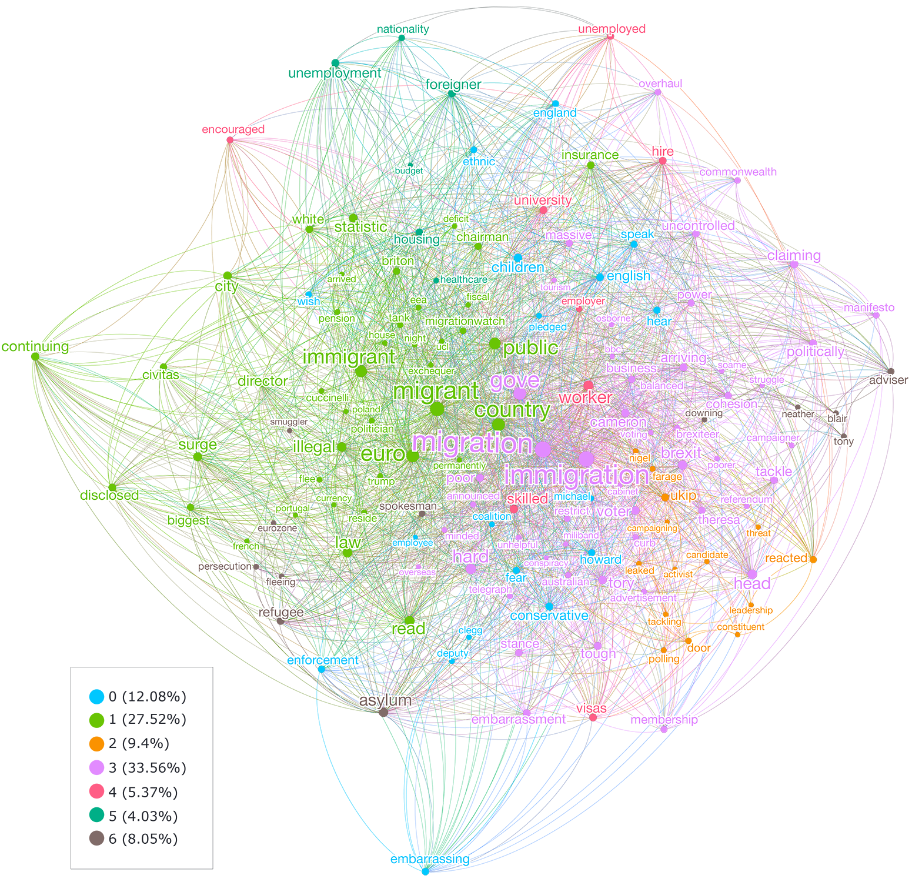

class: middle, animated, fadeIn

```{r setup, include=FALSE}
 options(htmltools.dir.version = FALSE)
```
<style>
.center2 {
  margin: 0;
  position: absolute;
  top: 50%;
  left: 50%;
  -ms-transform: translate(-50%, -50%);
  transform: translate(-50%, -50%);
}
</style>
<style>
.pre2 {
    display: block;
    font-family: monospace;
    white-space: pre;
    margin: 3em 0px;
    margin-top: 0em;
    margin-right: 0px;
    margin-bottom: 0em;
    margin-left: 0px;
}
</style>

<style>
.font80 {
  font-size: 80%;
}
</style>

# O Contexto de Pesquisa

1. Vésperas da separação oficial do **Reino Unido** da **Comunidade Comum Europeia**
1. Contexto desfavorável à imigração ou ao imigrantes no país
1. Influência da imprensa conservadora nos processos de percepção do *RU*
1. Constante presença e citação de artigos desta imprensa conservadora em mídias sociais.

---
class: animated, fadeIn, middle
# Aquilo que pretendemos
## Sociais e discursivos
.big[
* .RUred[Compreender] como a imprensa conservadora retrata o imigrante no contexto do *Brexit*
]

## Linguísticos

* .RUred[Verificar] as estratégias mais comuns no sistema de Avaliatividade
* .RUred[Verificar] a correlação positiva ou negativa entre tais escolhas
* .RUred[Estabelecer] o perfil de avaliação dos imigrantes em cada publicação

---
class: animated, fadeIn, middle

# Fundamentação teórica
* Linguística Sistêmico-Functional
  * Halliday (1978)
* Sistema de Avaliatividade
  * Martin e White (2005) / Alba-Juez & Thompson (2014)

# Metodologia
* Rede de colocados e Clusters (Brezina et. al, 2015)
  * Cowo (Levallois, 2021)/Gephi (Bastian et al. 2009)
* Análise multidimencional (Biber, 1995)
  * *Scripts* em linguagem .RUred[R]

---
class: animated, fadeIn, middle
# Corpora
.big[
|               |     Telegraph    |      Sun     |     Daily Star    |
|---------------|:----------------:|:------------:|:-----------------:|
|     Types     |        9106      |      8058    |        8543       |
|     Tokens    |       20468      |     15982    |        15378      |
|     TTRatio   |        0.45      |      0.50    |        0.55       |
]

---
class: animated, fadeIn, middle

# Networks
```{r fig1 ,echo=FALSE,fig.align='center',fig.cap="Network of collocations in the Daily Star",out.width="70%"}

```
---
class: animated, fadeIn, middle

```{r fig2 ,echo=FALSE,fig.align='center',fig.cap="Network of collocations in The Sun",out.width="60%"}

```
---
class: animated, fadeIn, middle

```{r fig3 ,echo=FALSE,fig.align='center',fig.cap="Network of collocations in The Telegraph",out.width="61%"}

```
---
class: animated, fadeIn, middle

|     Category                                                                      |     What it means                                        |     Appraisal   Function(s)                                                                             |     Examples                                                                                      |
|-----------------------------------------------------------------------------------|----------------------------------------------------------|---------------------------------------------------------------------------------------------------------|---------------------------------------------------------------------------------------------------|
|     Adjectives   - I (immigrants or immigration)                                  |     Immigrants' social and economic behaviour            |     Judgment   (social sanction)     Propriety     Affect   (negative)     Appreciation   (negative)    |     Bogus,   Awful, Destitute, Dangerous                                                          |
|     Mixed categories - I (Noun phases, adjectives and prepositional   phrases)    |     Where immigrants are from                            |     Intensification (Focus)     Sharpness                                                               |     Ethnic minorities, Portugal, from Eastern Europe, from poorer EU   countries, Iran, Polish    |
|     Mixed categories   – II (Proper nouns and noun phrases)                       |     Politicians and other entities voices for support    |     Heteroglossia                                                                                       |     Nigel Farage,   Boris Johnson, say, Official statisticians                                    |

---
class: animated, fadeIn, middle

# Results

```{r fig4, echo=FALSE,fig.align='center', fig.cap="Relationship between strategies and the appraisal system", out.width="70%"}


```
---
class: animated, fadeIn, middle


|                |     D1                                   |     D2                                                     |     D3                                  |     D4                                |
|----------------|------------------------------------------|------------------------------------------------------------|-----------------------------------------|---------------------------------------|
|                |     Immigrants and     border control    |     Legal status,     heteroglossia     and immigration    |     Heteroglossia     and job skills    |     Origin and     economic issues    |
|     NP_II      |     0.984                                |                                                            |                                         |                                       |
|     NP_I       |                                          |                                                            |                                         |     0.430                             |
|     MC_II      |                                          |                                                            |     0.378                               |                                       |
|     ADJ_II     |                                          |     -0.112                                                 |     0.527                               |                                       |
|     ADJ_III    |                                          |     0.178                                                  |     -0.453                              |     -0.147                            |
|     Modals     |     -0.101                               |     0.174                                                  |     0.531                               |     -0.180                            |
|     MC_I       |                                          |                                                            |                                         |     0.521                             |
|     ADJ_I      |     0.152                                |                                                            |                                         |     -0.279                            |
|     MC_III     |                                          |     0.936                                                  |                                         |     0.179                             |
|     VB         |                                          |     0.139                                                  |     0.104                               |     0.474                             |

---
class: animated, fadeIn, middle

```{r fig5, echo=FALSE,fig.align='center', fig.cap="Dimensions of Appraisal in the corpus"}


```

---
class: animated, fadeIn, middle

# Considerações Finais

- Notícias contribuem para a constituição da metáfora do conteúdo.
  - RU retratado como incapaz de dar conta dos processos sociais resultantes da imigração.
- Representações de imigrantes no contexto do BREXIT
  - Usurpadores do sistema de saúde e bem-estar social do RU;
  - Não sanitários e ilegais;
  - Merecedores e não merecedores de imigração;
    - Relação com questões profissionais e origem;
- Representação da relação econômica entre RU e CCE;
  - Economia europeia estaria prejudicando o RU;
- Ancoragem em vozes externas;
  - Discurso político-partidário e estatístico.
- Cada meio noticioso alimenta uma faceta específica do discurso anti-imigração.

---
class: inverse, animated, fadeIn, middle

## Financiamento

.pull-left[

```{r fig7 ,echo=FALSE,fig.align='center',out.width = "150px"}
knitr::include_graphics('./images/cardiff.png')
```
]
.pull-right[
```{r fig6 ,echo=FALSE,fig.align='center',out.width = "200px"}

```
]

## Obrigado!


.RUred[Rodrigo Esteves de Lima-Lopes]

.pull-left[
[rll307@unicamp.br](mailto:rll307@unicamp.br)


[http://www.iel.unicamp.br/rll307](http://www.iel.unicamp.br/rll307)

[https://github.com/rll307/](https://github.com/rll307/)
]


.pull-right[
```{r fig10 ,echo=FALSE,fig.align='center', out.width = "200px"}

```
]


